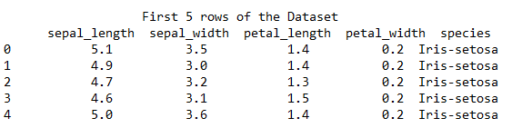
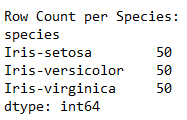
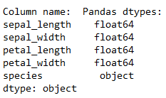
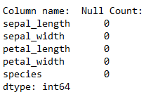
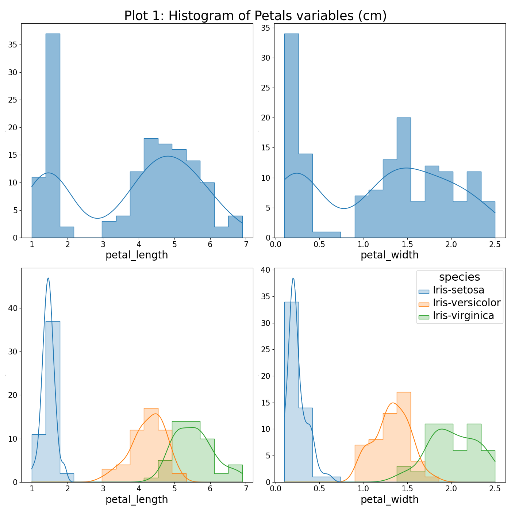
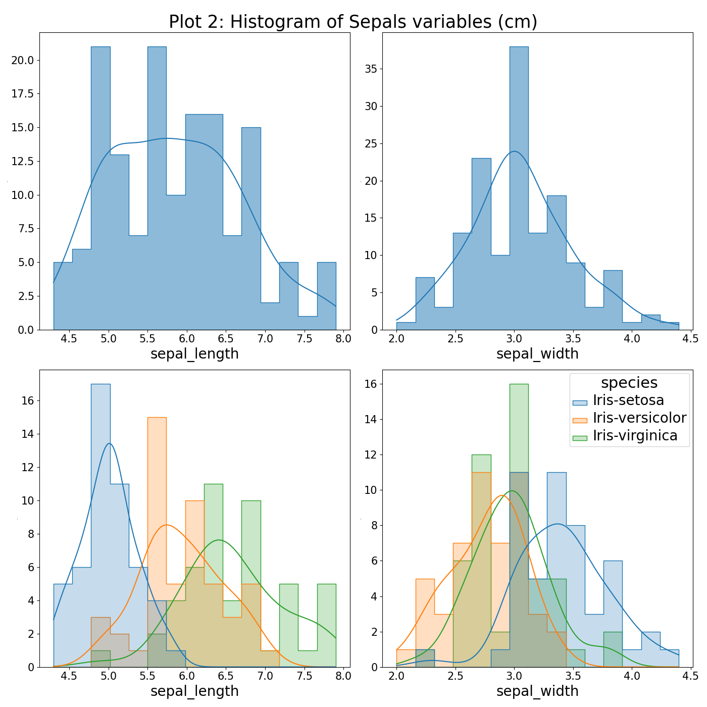
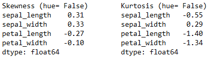
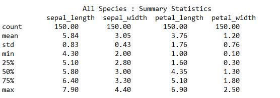
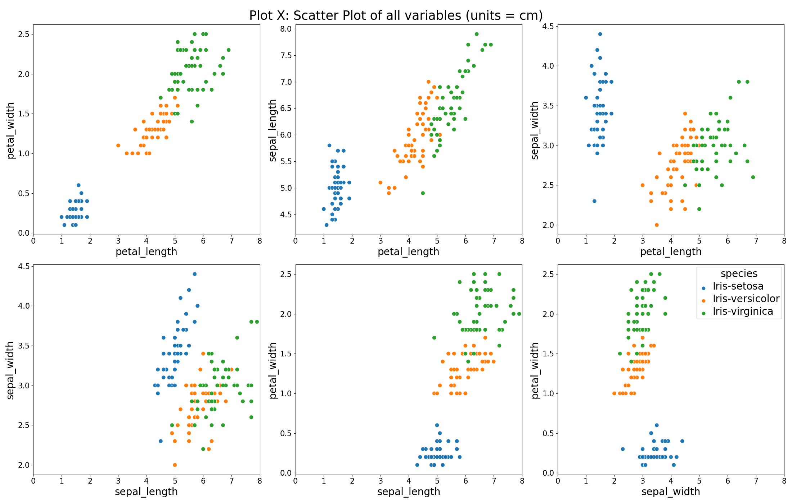
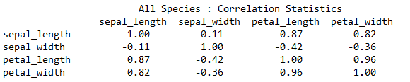

<br/>

<p align="center">
  
</p>  <Source: https://image.ibb.co/gw4Gen/Index_GMIT.png>

<br/>
<br/>

<h1 align="center"><em><strong>Higher Diploma in Data Analytics  </h1></em></strong><br/>
<h1 align="center"><em><strong>The Fisher’s Iris Data Set - Ciaran Moran </h1></em></strong><br/>

<br/>
<br/>
<br/>

## Table Of Contents 
### 1. Introduction
&emsp; 1.1 Project Outline and Objectives<br> 
### 2. Background
&emsp; 2.1 Describing the Data Set <br>
&emsp; 2.2 History of the Data Set <br>
&emsp; 2.3 Linear Discriminant Analysis and Machine learning <br>
### 3. Investigation
&emsp; 3.1 Getting Started <br>
&emsp; 3.2 Exploring The Data Set <br>
&emsp; &emsp; 3.2.1 Reading in the Dataset<br/>
&emsp; &emsp; 3.2.2 Analysing the Dataframe<br/>
&emsp; &emsp; 3.2.3 Descriptive Statistical Analysis<br/>
&emsp; &emsp; 3.2.4 Correlation Analysis <br>
&emsp; 3.3 Machine Learning <br>
&emsp; &emsp; 3.3.1 Feature Selection <br>
&emsp; &emsp; 3.3.2 Choosing a model <br>
### 4. Discussion 
### 5. References 

<br/>
<br/>

### 1. Introduction 
&nbsp;**1.1 Project Outline and Objectives**


This Repository contains all the files relevant to my 2021 Project as part of my Programming and Scripting module. The project investigates the famous Fisher Iris Data set and applies a python-based methodology to explore the data. This README file contains of Summary of my findings.
The projects main aims are to achieve the following through incremental progress:
- Research the data set online and detail findings.
- Download the data set and add it to my repository. 
- Write a python program (analysis.py) that contains functions that can do the following:
  - Output a summary of each variable to a single text file.
  - Save a histogram of each variable to png files.
  - Save scatter plots of each pair of variables to png files.

<br/>

### 2. Background
**2.1 Describing the Data Set**

The iris dataset is widely recognised in the field of data analytics as being a relatively small dataset of which non-trivial deductions can be made. The dataset is comprised of 150 observations (rows of data) and 5 attributes (columns of data). The attributes contain data on the iris petal / sepal dimensions across three even species samples (50 rows each)[5]. 
In summary, each row of data pertains to a single observation across the four listed anatomical dimensional attributes for a given species of iris.

&nbsp;**Dataset Attributes:**
   - Sepal length in cm
   - Sepal width in cm
   - Petal length in cm
   - Petal width in cm
   - Species (see Fig 1.)

<br/>

| |
|----------|
| Fig 1. Iris Species [2]|

<br/>
<br/>

**2.2 History of the Iris Data Set**

The iris data set observations were collected at the Gaspé Peninsula by a botanist named Edgar Anderson [1]. Born in 1897 in New York, he made many contributions to botanical genetics. He worked alongside a successful scientist named Ronald Fisher, who would explore the dataset using statistical techniques that are widely used today.<br/>
<br/>
Ronald Fisher was an accomplished statistician and geneticist, born in 1890 in London and a pioneer in applying statistical procedures to the design of experiments [4]. According to Hald (1998, as cited in Fernandes, 2016) ,“Fisher was a genius who almost single-handedly, created the foundations for modern statistical science” [3]. In 1936, with Edgar’s consent, Fisher published a famous paper titled “the Use of Multiple Measurements in Taxonomic Problems” that explored a linear function to distinguish between iris species based on their morphology [1]. The paper shows how fisher explored classification of different species through Linear Discrimination Analysis on the multivariate data set. Based on his contributions, the iris dataset is commonly referred to as the Fisher iris data set.
<br/>

| |
|----------|
| Fig 2. Ronald Fisher [6]|

<br/>
<br/>

**2.3 Linear Discriminant Analysis and Machine learning**<br/>

Today LDA is a generalization of Fishers Linear discriminant, labelled as a supervised classification method that has the potential to separate two or more classes [Gonzalez, J, 2018] (species in the case of Iris data set). As detailed by Gonzalez (2018), the separation algorithm works by a reduction technique where the data is projected onto a lower-dimensional space, while retaining the class-discriminatory information. Although this reduction technique allows for linear classification it is important to note that the model does have two underlying assumptions which are described by Brownlee (2016):
1.	The data distribution is Gaussian, i.e is shaped like a bell curve.
2.	Each class has the same covariance matrix.

This model’s first assumption can be successfully applied to many data sets as Gaussian distributions appear regularly in the real-world data. This was explained well by Sharma (2019) where he described how larger data sets with finite variances and independent feature probabilities will have a data distribution that favours the bell curve shape [Sharma, R, 2019]. When considering the second assumption it its important to note that covariance indicates the direction of the linear relationship between variables [Janakiev, N, 2018] and is used as a measure of how two random variables vary together. If one assumes that each species in the Iris data set has the same covariance matrix, they assume that the linear correlation between randomly selected variables in a given species is equal for the same variables in all other species. 

It is important to understand the implications of choosing a particular model and the potential for inaccurate results if the model assumptions are not representative of the data set. Today the advances in Machine Learning provides us an opportunity to test and alter multiple data analysis library models to our needs. As described by Wakefield (2018), “machine learning uses programmed algorithms that receive and analyze input data to predict output values within an acceptable range. As new data is fed to these algorithms, they learn and optimize their operations to improve performance, developing intelligence over time”. Machine learning is broken into two main categories, supervised and unsupervised which are explained in points 1 and 2 below:(Soni 2018).

1.	Unsupervised learning deals with the inherent structure of the data without using labels, an example would be a clustering algorithm that can segregate datapoints into objects based on their relative distance to other datapoints. 
2.	Supervised learning is typically used for classification problems, when one wants to map the inputs to a desired labelled output, or regression when one wants to map the input to a continuous output . 

This project will further explore and test supervised machine learning classification models on the Iris Dataset.

<br/>
<br/>

### 3. Investigation
**3.1 Getting Started**

This Section details the downloads, modules, tools, libraries and dependencies for this project.
<br/>

- Visual Studio Code 1.55.0 was the chosen source code editor. <br/>
  - Downloaded here (**<https://code.visualstudio.com/download>**).

- Python 3.8.5 was used as the programming language for this data analysis project. <br/>
  - Downloaded here (**<https://www.python.org/downloads/>**).

- Anacondas was downloaded for its many useful libraries included in the package. <br/>
  - Download here (**<https://docs.anaconda.com/anaconda/install/>**).<br/>
    Main libraries used: <br/>
    - numpy 1.19.2 <br/>
    - pandas 1.1.3 <br/>
    - matplotlib 3.3.2 <br/>
    - seaborn 0.11.0 <br/>

- Fisher Iris Dataset:
  - Downloaded here (**<http://archive.ics.uci.edu/ml/datasets/Iris>**). <br/>
  - Saved as ‘’Iris_Data_Set.txt” in the same directory as Analysis.py module. <br/>

- Analysis.py<br/>
  - This Python module contains the source code used to generate a Summary text file and output plots. <br/>
  - It Conisits of numerous functions that will be referenced throughout this investigation. <br/>
  - Code References will be located in the module and donted via [*1]...[*n...] etc.. <br/>
  - The module makes directory hierarchy assumptions relative to its location for reading the Iris dataset / outputing plots. <br/>
  - Note: For best results and ease of use clone repository as described here: <br/>(**<https://docs.github.com/en/github/creating-cloning>**).

<br/>
<br/>

**3.2 Exploring The Data Set** <br/>
Note: any use of abbreviation *df* refers to a dataframe.

<br/>

__Reading in the Dataset:__ [F1*] <br/>
This was achieved using the *read_csv()* method of the pandas library. This method also works on text files as one can declare the delimiter value that separates each data field, which in this case is a comma. 

<br/>

__Analysing the Dataframe__ [F2*] <br/>
The first 5 rows of the Dataframe were observed by passing 5 into the *df.head(n)* method of the pandas library. This method is useful as it allows the user to look at a subset of the data to deduce what columns are relevant and to perform quick checks to see if data transformations are performing as expected. It was noticed that the column headers were indexed from 0-3 by pandas as the Dataset that was downloaded did not include column names. Based on these findings the correct column names were passed as a list to the *df.columns* method, see figure 3.

<br/>

| |
|----------|
| Fig 3.|


<br/>

As mentioned in Section 2.1 the Iris dataset is made up of 150 rows and 5 columns. Like many applications in pandas the array size can be confirmed in more than one way, for example using the *df.shape* method or alternatively one can deduce the axes lengths using this code:
``` Python
shape = (len(iris_df.axes[1]),len(iris_df.axes[0]))   
```
<br/>

The pandas library provides aggregation functions to group a column and perform many operations such as sum, count and mean. This functionality was used to confirm that the dataset was made up three different species, each contributing 50 instances to the 150 total row count (See Fig 4 below). The operation was performed using the following syntax: *df.groupby('species').size()*.

<br/>

Having looked at the first 5 rows of the dataset assumptions were made that the sepal legth, sepal width, petal length and petal width columns were floating point numbers and the species column was of type string. These assumptions were tested by passing the dataframe into the pandas *dtypes* function. The output showed that the four dimensional variable columns were of type 'float64' and the species class column of type 'object' (see Fig. 5 below). Moffitt 2018 explained this by describing how pandas stores datatypes in a categorical way and buckets type str and mix data types into the 'object' category.<br/> 

<br/>

Pandas and Numpy work effectively together to help clean dataframes, for example the *isnull()* function is used to detect missing values in an array. This function returns a boolean object where missing values get mapped to True and non-missing values get mapped to False [GfG 2020 NaN]. It is possible to sum the True values from the boolean array by applying the *sum()* function to quickly check if a dataset has any null values. This operation was performed on the Iris dataframe and yielded no null values via the following syntax: *df.groupby('species').size()*, see the output of this operation in Fig. 6 below.<br/> 

<br/>

| | 
:-------------------------:|:-------------------------:|:-------------------------:
Fig. 4  |  Fig. 5  |  Fig. 6
  
<br/>

If one was dealing with larger datasets it would be unlikely that a null count of zero will be encountered. One can clean a dataset with null values in a number of ways. For example its possible to replace null values with a selection of your choice by passing this selection into the *fillna()* pandas function and applying it on your dataframe. It is also possible to drop rows that contain null values using the *drop na()* function. In addition to this Solomon 2020 detailed NumPy's ability to generate Boolean masks on arrays that can be utilised alongside pandas functions to perform fast detailed cleaning operations. An example of this would be using the Numpy *np.where()* function alongside pandas *replace()* function to replace string in a series at defined locations. The takeaway point here is that python libraries such as Pandas and NumPy have a lot of functionality that help deal with un-cleansed data. 

<br/>

__Descriptive Statistical Analysis__<br/>

__Histogram Analysis__<br/>
Histograms are considered simple plots but can give very useful visualisations on the distribution of the data. To gain more insight into the Iris data a histogram of each feature (i.e dependant variable) was plotted. Each dependent variable has two plots, one consists of the variables with no grouping (blue plots) and the second consists of the variables grouped by species (multi-coloured plots), see figure X below for petal variable plots.

<br/>

<p align="center">
  
</p>  

<br/>

- __Un-grouped Petal Data__: Looking at the density plots of the blue histograms in fig X it becomes apparent that although the petal length and width distribution curves do have a degree of symmetry, they do not exhibit the bell curve “normal” distribution. These distributions instead, are typically referred to as bimodal as there is two local maximums present [Ye 2020]. This distribution often occurs when there is more than one population or class present in the data. In light of this the data was grouped by species using the Seaborn library's grouping variable called “hue”, which seperated the histogram into its three individual species classes. <br/>

<br/>

- __Grouped Petal Data__: The grouped histograms for petal length and petal width clearly show that for these features the Setosa species is well separated from Versicolor and Virginica. It was also noted that petal width and petal length showed a degree of separation between the versicolor and virginica species, with more overlap of probability densities apparent when looking at petal length. Based on these observations one could speculate that the petal attributes could play an important role in any attempt to classify the setosa class through any supervised machine learning model. See Plot 2 below for sepal feature histograms.

<br/>

<p align="center">
  
</p>  

<br/>

- __Sepal Data__: 
The un-grouped sepal variable histograms (blue) do show a guassian like distribution curve. On further breakdown of the plots into their species (multicoloured) it became apparent that there is significant overlapping of data between the Versicolor and Virginica species for both the sepal length and sepal width features, however the Setosa does show some seperation. Due to serpation observed one could assume that a machine learning model could seperate Setosa from the other two species with a relatively high degree of accuracy.

<br/>

__Skew & Kurtosis functions:__:<br/>
It was possible also possible to gain insight into data distributions via two pandas functions called **df.skew()** and **Series.kurtosis()**. Dan 2020 describes these two functions and how to evaluate their outputs:<br/>
- **df.skew()**: Measures how symmetric a data distrubition is. The Function computes the "skewness" of the data present in a given axis of the DataFrame object. A skew value between -0.5 and 0.5 is considered symmetrical.<br/>
- **series.kurtosis()**: Measures the heaviness of the distribution tails. The function computes the tail volumne difference relative to a guassian distribution curve. A kurtosis value of 0 is considered normal distribution, negative inidicates a flat thin-tailed distribution, positive indicates pointy fat-tailed distribution curves and a kurtosis value that exceeds absolute 3 indicates Excess Kurtosis.<br/>

These two distrubtion functions were used to further analyse the ungrouped iris features (see Fig X for results). The results showed that for iris features a degree of symmetry exists in the data distributions as all skew values lie between -0.5 and 0.5. The sepal length and sepal width attribues have a slightly right learning skew whearas the petal length and petal width attributes data curve is leaning slightly to the left. All the kurtosis values for this datset do not exceed absolute 3, which indicates that for future sample selection there would be a low probability of obtaining an extreme outlier relative to the normal distribution curve. <br/>

<br/>

| |
|----------|
| Fig X.|
<br/>

**describe() Function**<br/>
The pandas *describe()* function is a very useful statistical summary method that can be applied to a given dataset. In its standard form this function returns the min, max, mean, median, 25th percentile, 75th percentile and standard deviation of the data. The Iris dataset was passed to this function, see Fig X below for statistical summary of the 4 attributes in the Iris Dataset. 

<br/>

| |
|----------|
| Fig X.|

<br/>

The following observations were drawn from Fig X:

- **Mean:** <br/>
  Sepal length > petal length > sepal width > petal width.<br/>
 
- **Standard Deviation:** <br/>
  Petal length samples shows the highest deviation from the mean. Sepal width samples show the lowest deviation from the mean.<br/>
  
- **Min / Max range:**<br/>
  Overlap between dimensional attributes exists.<br/>
  Setosa species generally has the smallest features while Virginica species tends to have largest features. <br/>

- **Median (50th percentile) and Mean comparison:**<br/>
  Sepal length and sepal width have the lowest difference between their median (50th percentile) and mean values which indicates that these attributes have a distribution that closer fits the bell curve / guassian distribution when compared to that of petal length and petal width. This observation was confirmed by referencing back to the histograms (see figure X). <br/> 

<br/>

__Boxplot Analysis:__ <br/>
In addition to the analyis already performed it was considered necessary to visualise the data distriubtion with the same y-axis scaling for each iris feature across all species. The boxplot came to mind as a suitable plotting method as it displays the data distribution in a standardized way and yields information on the symmetry and outliers in the dataset (see figure X). 

<br/>

 

The following observations were drawn from Fig X:
- Data Distribution:
  - Petal width data doesn’t overlap with other features across all species. This observation confirms that a machine learning classification model could identify this attribute while retaining all other iris features in the model.
  - Petal length data range is the largest, especially for the virginica species. 
  - Although the skew model indicated that petal width data (un-grouped) had a skew value nearest to zero, it can be observed in the boxplot that the distribution appears negatively skewed for the Versicolour species on its own. This observation was made as the median is closer to the first quartile while the lower whisker is shorter than that of the top whisker. This can also be observed in the multi-coloured histogram in Fig X. 
- Outliers:
  - The setosa species has four outliers, two for petal length and two for petal width features. 
  - The Virginica species also has three outliers, one for sepal length and two for sepal width.
  - Having analysed the outliers from the boxplot it became apparent that one can deduce outlier information from a histogram also. If a large number of bins are set in the histogram the outlier will be more  obvious, however in this case where a medium value of bins were selected one can see potential outliers where there is a large difference between the bin height and the probability density curve.(see fig X petal length).

<br/>

__3.2.4 Correlation Analysis__<br/>

To better understand any potential relationships between the variables in the dataset a scatter plot was generated comparing all iris fearures agaisnt eachother (see plot 3 below). As detailed by Brownlee 2018, it is important to discover and quantify the degree to which variabeles are depenadnt on eachother. He then goes on to explain how a better understanding of variable correlation can help you perpare your data for use in machine learning algorithms.

<br/>

<p align="center">
  
</p> 

<br/>

On analysis of the scatter plots it was established that petal length and petal width features appeared to have a high degree of positive linear correlation, that is to say that as petal length increases petal width also increases at a similar rate. Sepal length vs petal length  and sepal length vs petal width regression lines also show a positive degree of linear correlation.
The pandas library has a useful method called *.corr* which can be used to compute pairwise correlation of variables. This method was used on iris dataset, which by default uses the Pearson method when the type is not declared in the function,  see Fig X.

<br/>

| |
|----------|
| Fig X.|

<br/>

Figure X pairwise correlation data re-affirmed the correlation observations made from the scatter plots with petal length and petal width showing the highest positive linear correlation with a value of 0.96. 

<br/>

__3.3 Machine Learning__ <br>

__3.3.1 Feature Selection__
Feature selection is an important process that is used in machine learning to choose the features of the dataset that best describe the target and if needed drop variables that dont describe the target output. Asaithambi 2018 describes how models with higher levels of dimensionality can struggle as training time increases exponentially with number of features and the model has a higher risk of overfitting. As the Fisher Iris dataset has a low number of variables one could presume that dimensionality reduction of the dataset would be less important when feeding the data to a machind learning model, however this avenue will be explored in more detail. 

<br/>

### 5. Reference:
[1]. Cui, Y 2020, The Iris dataset – a little bit of history and biology, towards data science, viewed 26 Match 2021,**<https://towardsdatascience.com/the-iris-dataset-a-little-bit-of-history-and-biology-fb4812f5a7b5>.**<br/>
[2]. Dynatrace, 2021, [image], accessed 26 March 2021, **<https://www.pngkey.com/maxpic/u2q8t4w7q8w7u2u2/>.**<br/>
[3]. Fernandes, M 2016, 'From Three Fishers: Statistician, Geneticist and Person to Only One Fisher: The Scientist', Journal of Biometrics & Biostatistics, vol. 7, no. 1, pp. 1, DOI: 10.4172/2155-6180.1000282.<br/>
[4]. Jain, P, 2011, Sir Ronald Aylmer Fisher, Encyclopaedia Britannica,<br/> **<https://www.britannica.com/biography/Ronald-Aylmer-Fisher>.**<br/>
[5]. UC Irvine Machine Learning Repository, 2021, Iris dataset, viewed 26 March 2021,<br/>**<http://archive.ics.uci.edu/ml/machine-learning-databases/iris/iris.names>.**<br/>
[6]. Wikipedia, 2021, [image], accessed: 28 March 2021, **<https://en.wikipedia.org/wiki/Ronald_Fisher#/media/File:Youngronaldfisher2.JPG>.**<br/>
[X] Sharma, R, 2019, Gaussian distribution, viewed 31 March 2021,<br/>**<https://medium.com/ai-techsystems/gaussian-distribution-why-is-it-important-in-data-science-and-machine-learning-9adbe0e5f8ac>.**<br/>
[X] Janakiev, N, 2018, Understanding the Covariance Matrix, viewed 31 March 2021, <br/>**<https://datascienceplus.com/understanding-the-covariance-matrix/>.**<br/>
[X] Gonzalez, J, 2018, Using linear discriminant analysis (LDA) for data explore, viewed 31 March 2021,<br/>**<https://www.apsl.net/blog/2017/07/18/using-linear-discriminant-analysis-lda-data-explore-step-step/>**<br/>
[X] Brownlee, L, 2016, Linear discriminant analysis for Machine Learning, viewed 05 April 2021,<br/>**<https://machinelearningmastery.com/linear-discriminant-analysis-for-machine-learning/>**<br/>
[X]: Wakefield, K. (2018). A guide to machine learning algorithms and their applications, viewed 05 April 2021, <br/>**<https://www.sas.com/en_ie/insights/articles/analytics/machine-learning-algorithms.html>**<br/>
[X] Soni, D, 2018, Supervised Vs. unsupervised learning, towards data science, viewed 05 April 2021,<br/>**<https://towardsdatascience.com/supervised-vs-unsupervised-learning-14f68e32ea8d>**<br/>
[X] GeeksforGeeks, 2020, Count NaN or missing values in Pandas DataFrame, viewed 15 April 2021,**<https://www.geeksforgeeks.org/count-nan-or-missing-values-in-pandas-dataframe>**<br/>
[X] Moffitt, C, 2018, Overview of Pandas data types, Practical Business python, viewed 15 April 2021,**<https://pbpython.com/pandas_dtypes.html>**.<br/>
[X] Solomon, B, 2021, Pandas GroupBy: Your Guide to Grouping Data in Python, RealPython, viewed 16 April 2021,**<https://realpython.com/pandas-groupby/#pandas-groupby-putting-it-all-together>**.<br/>
[X] Dan, A, 2022, Kurtosis() & Skew() Function In Pandas, medium.com, viewed 19 April 2021, **<https://medium.com/@atanudan/kurtosis-skew-function-in-pandas-aa63d72e20de>**.<br/>
[X] Ye, A, 2020, viewed 22 April 2021, All the distributions you need to know, towards data science, viewed 22 April 2021,<br/> **<https://towardsdatascience.com/all-the-distributions-you-need-to-know-ad570514987b>**.<br/>
[X] Brownlee, J, 2018, A Gentle Introduction to k-fold Cross-Validation, viewed 27 April 2021,<br/> **<https://machinelearningmastery.com/k-fold-cross-validation/.>**.
[X] Brownlee, J, 2018, How to Calculate Correlation Between Variables in Python, viewed 23 April 2021,<br/> **<https://machinelearningmastery.com/how-to-use-correlation-to-understand-the-relationship-between-variables/>**.
[X] Saha, S, 2018, Baffled by Covariance and Correlation??? Get the Math and the Application in Analytics for both the terms, towards data science, viewed 23 April 2021, **<https://towardsdatascience.com/let-us-understand-the-correlation-matrix-and-covariance-matrix-d42e6b643c22>.**
[X] Malik, U, 2021, Applying Wrapper Methods in Python for Feature Selection, Stack Abuse, **<https://stackabuse.com/applying-wrapper-methods-in-python-for-feature-selection/>.**.
[X] Asaithambi, S, 2018, Why, How and When to apply Feature Selection, viewed 26 April 2021, **<https://towardsdatascience.com/why-how-and-when-to-apply-feature-selection-e9c69adfabf2>.**
[X] Harrison, O, 2018, Machine Learning Basics with the K-Nearest Neighbors Algorithm, towards data science, viewed 26 april 2021, **<https://towardsdatascience.com/machine-learning-basics-with-the-k-nearest-neighbors-algorithm-6a6e71d01761>.**