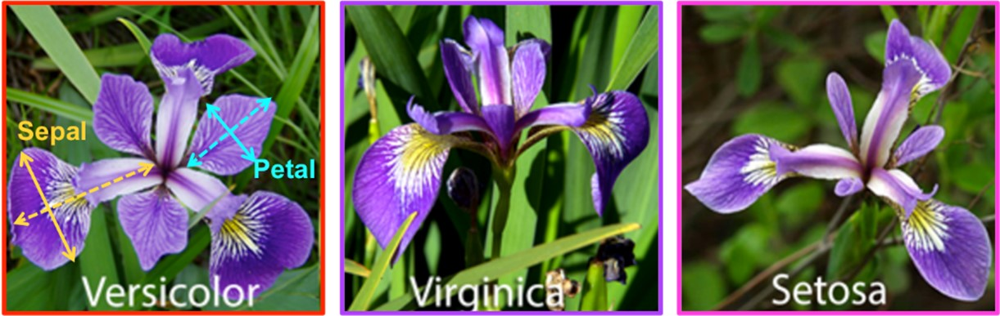
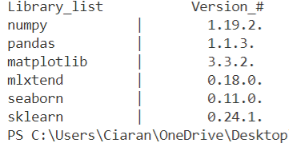
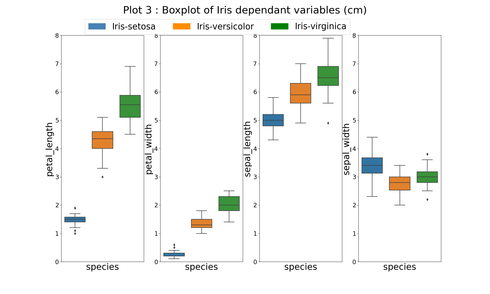
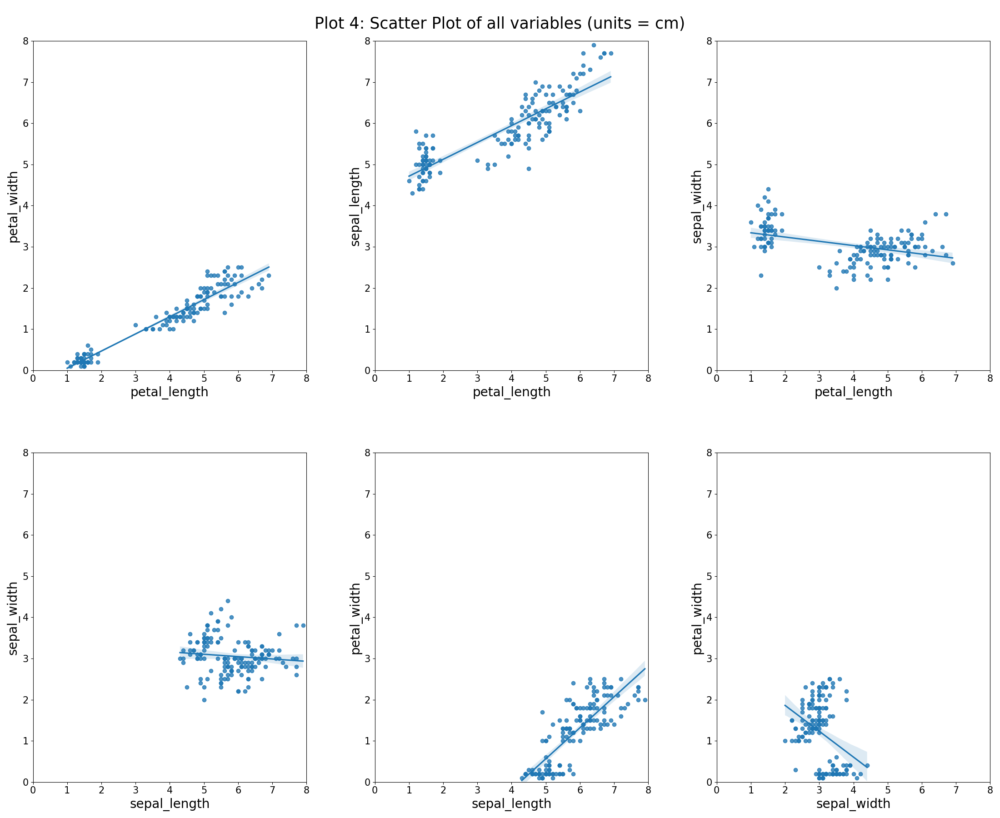
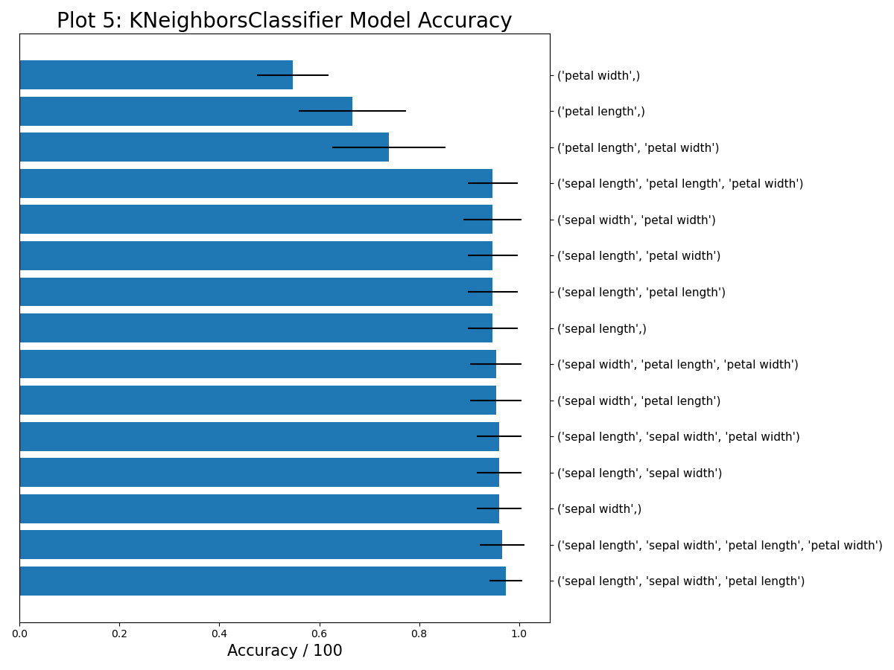
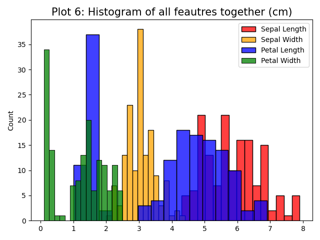
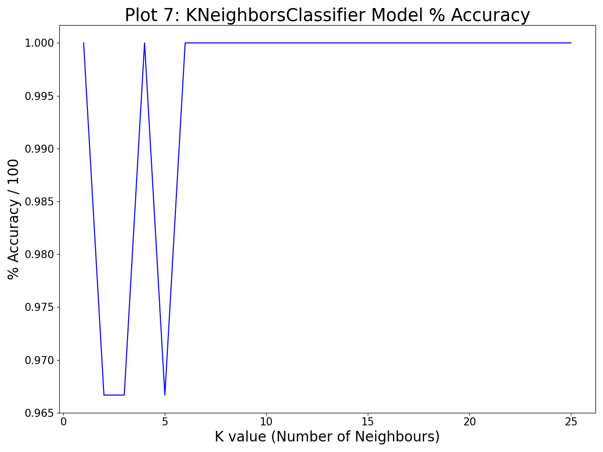

<br/>

<p align="center">
  
</p>  <Source: https://image.ibb.co/gw4Gen/Index_GMIT.png>

<br/>
<br/>

<h1 align="center"><em><strong>Higher Diploma in Data Analytics  </h1></em></strong><br/>
<h1 align="center"><em><strong>The Fisher’s Iris Data Set - Ciaran Moran </h1></em></strong><br/>

<br/>
<br/>
<br/>

## Table Of Contents 
### 1. Introduction
&emsp; 1.1 Project Outline and Objectives<br> 
### 2. Background
&emsp; 2.1 Describing the Data Set <br>
&emsp; 2.2 History of the Data Set <br>
&emsp; 2.3 Linear Discriminant Analysis and Machine learning <br>
### 3. Investigation
&emsp; 3.1 Getting Started <br>
&emsp; 3.2 Exploring The Data Set <br>
&emsp; &emsp; 3.2.1 Reading in the Dataset<br/>
&emsp; &emsp; 3.2.2 Analysing the Dataframe<br/>
&emsp; &emsp; 3.2.3 Descriptive Statistical Analysis<br/>
&emsp; &emsp; 3.2.4 Correlation Analysis <br>
&emsp; 3.3 Machine Learning <br>
&emsp; &emsp; 3.3.1 Feature Selection <br>
&emsp; &emsp; 3.3.2 Choosing a model <br>
### 4. Discussion 
&emsp; &emsp; 4.1 Summary <br>
&emsp; &emsp; 4.2 Lessons learned <br>
### 5. References 

<br/>
<br/>

### 1. Introduction 
&nbsp;**1.1 Project Outline and Objectives**


This Repository contains all the files relevant to my 2021 Project as part of my Programming and Scripting module. The project investigates the famous Fisher Iris Data set and applies a python-based methodology to explore the data. This README file contains of Summary of my findings.
The projects main aims are to achieve the following through incremental progress:
- Research the data set online and detail findings.
- Download the data set and add it to my repository. 
- Write a python program (analysis.py) that contains functions that can do the following:
  - Output a summary of each variable to a single text file.
  - Save a histogram of each variable to png files.
  - Save scatter plots of each pair of variables to png files.
- Explore a supervised machine learning model on the dataset.

<br/>

### 2. Background
**2.1 Describing the Data Set**

The iris dataset is widely recognised in the field of data analytics as being a relatively small dataset of which non-trivial deductions can be made. The dataset is comprised of 150 observations (rows of data) and 5 attributes (columns of data). The attributes contain data on the iris petal / sepal dimensions across three even species samples (50 rows each)[18]. 
In summary, each row of data pertains to a single observation across the four listed anatomical dimensional attributes for a given species of iris.

&nbsp;**Dataset Attributes:**
   - Sepal length in cm
   - Sepal width in cm
   - Petal length in cm
   - Petal width in cm
   - Species (see Fig 1.)

<br/>

| |
|----------|
| Fig 1. Iris Species [6]|

<br/>
<br/>

**2.2 History of the Iris Data Set**

The iris data set observations were collected at the Gaspé Peninsula by a botanist named Edgar Anderson [4]. Born in 1897 in New York, he made many contributions to botanical genetics. He worked alongside a successful scientist named Ronald Fisher, who would explore the dataset using statistical techniques that are widely used today.<br/>
<br/>     
Ronald Fisher was an accomplished statistician and geneticist, born in 1890 in London and a pioneer in applying statistical procedures to the design of experiments [11]. According to Hald (1998, as cited in Fernandes, 2016) ,“Fisher was a genius who almost single-handedly, created the foundations for modern statistical science” . In 1936, with Edgar’s consent, Fisher published a famous paper titled “the Use of Multiple Measurements in Taxonomic Problems” that explored a linear function to distinguish between iris species based on their morphology [4]. The paper shows how fisher explored classification of different species through Linear Discrimination Analysis on the multivariate data set. Based on his contributions, the iris dataset is commonly referred to as the Fisher iris data set.
<br/>

| |
|----------|
| Fig 2. Ronald Fisher [20]|

<br/>
<br/>

**2.3 Linear Discriminant Analysis and Machine learning**<br/>

Today LDA is a generalization of Fishers Linear discriminant, labelled as a supervised classification method that has the potential to separate two or more classes [9] (species in the case of Iris data set). As detailed by Gonzalez (2018), the separation algorithm works by a reduction technique where the data is projected onto a lower-dimensional space, while retaining the class-discriminatory information. Although this reduction technique allows for linear classification it is important to note that the model does have two underlying assumptions [2]:
1.	The data distribution is Gaussian, i.e is shaped like a bell curve.
2.	Each class has the same covariance matrix.

This model’s first assumption can be successfully applied to many data sets as Gaussian distributions appear regularly in the real-world data. This was explained well by Sharma (2019) where he described how larger data sets with finite variances and independent feature probabilities will have a data distribution that favours the bell curve shape [15]. When considering the second assumption it its important to note that covariance indicates the direction of the linear relationship between variables [12] and is used as a measure of how two random variables vary together. If one assumes that each species in the Iris data set has the same covariance matrix, they assume that the linear correlation between randomly selected variables in a given species is equal  in all other species. 

It is important to understand the implications of choosing a particular model and the potential for inaccurate results if the model assumptions are not representative of the data set. Today the advances in Machine Learning provides us an opportunity to test and alter multiple data analysis library models to our needs. As described by Wakefield (2018), “machine learning uses programmed algorithms that receive and analyze input data to predict output values within an acceptable range. As new data is fed to these algorithms, they learn and optimize their operations to improve performance, developing intelligence over time”. Machine learning is broken into two main categories, supervised and unsupervised which are explained in points 1 and 2 below [17].

1.	Unsupervised learning deals with the inherent structure of the data without using labels, an example would be a clustering algorithm that can segregate datapoints into objects based on their relative distance to other datapoints. 
2.	Supervised learning is typically used for classification problems, when one wants to map the inputs to a desired labelled output, or regression when one wants to map the input to a continuous output . 

This project will further explore and test supervised machine learning classification models on the Iris Dataset.

<br/>
<br/>

### 3. Investigation
**3.1 Getting Started**

This Section details the downloads, modules, tools, libraries and dependencies for this project.
<br/>

- Visual Studio Code 1.55.0 was the chosen source code editor. <br/>
  - Downloaded here (**<https://code.visualstudio.com/download>**).

- Python 3.8.5 was used as the programming language for this data analysis project. <br/>
  - Downloaded here: **<https://www.python.org/downloads/>**.

- Anacondas 3 (version 2020.11) was downloaded for its many useful libraries included in the package. 
  - Downloaded here **<https://docs.anaconda.com/anaconda/install/>**.<br/>
  - On Windows the following command will upgrade Anacondas to current version if needed : *python -m pip install --upgrade pip*. 
- See figure 3 below for libraries used and their version numbers:
  - All libraries except mlxtend are included in the Anacondas 3 package. 
  - On Windows the following command 'conda install -c conda-forge mlxtend' will install the m*lxtend* package.
  - To individually install any other package listed in Fig 3. type 'pip install *package_name*' into command line.
     <br/>

<br/>

| |
|----------|
| Fig 3. |

<br/>

- Fisher Iris Dataset:
  - This was downloaded here : **<http://archive.ics.uci.edu/ml/datasets/Iris>**. <br/>
  - This was saved as ‘’Iris_Data_Set.txt” in the same directory as Analysis.py module. <br/>

- Repository:
  - Repository is located here: **<https://github.com/CiaranMoran27/pands-project2021>**.
  - Note: For best results and ease of use clone repository as described here: **<https://docs.github.com/en/github/creating-cloning-and-archiving-repositories/cloning-a-repository>**.


- analysis.py <br/>
  - Contains source code used to generate summary_file.txt and output plots that are written to the Images folder as .png files.
  - Consists of numberous functions that will be referenced throughout the README file. <br/>
  - Code References will be located in the module at the top of each function and denoted via [*1], [*2],[*n..] etc 
  - Run analysis.py to execute the functions and write summary and relevent plots.
  <br/>

- machine_learning.py<br/>
  - Contains source code used to generate three machine learning plots which are written to Images folder as .png files.
  - Consists of three functions that will be referenced throughout the README file and denoted as in analysis.py.
  - Run machine_learning.py to execute the functions and write the plots.

<br/>
<br/>
<br/>

**3.2 Exploring The Data Set** <br/>
Note: any use of abbreviation *df* refers to a dataframe.

<br/>

__3.2.1 Reading in the Dataset:__ <br/>
This was achieved using the *read_csv()* method of the pandas library [F1*]. This method also works on text files as one can declare the delimiter value that separates each data field, which in this case is a comma. 

<br/>

__3.2.2 Analysing the Dataframe:__ <br/>
For this investigation a *Summary* Class was created in *analysis.py* to process a summary object that was instantiated during the investigation [F2*]. Within this class there is an instance method that writes the summary object to a summary text file called summary_file.txt [F3*]. Note: In the proceeding investigation Fig.4 to Fig.10 were generated and written to the text file using the *Summary* Class.

<br/>

The first 5 rows of the Dataframe were observed by passing 5 into the *df.head(n)* method of the pandas library. This method is useful as it allows the user to look at a subset of the data to deduce what columns are relevant and to perform quick checks to see if data transformations are performing as expected. It was noticed that the column headers were indexed from 0-3 by pandas as the Dataset that was downloaded did not include column names. Based on these findings the correct column names were passed as a list to the *df.columns* method, see figure 4.

<br/>

| |
|----------|
| Fig 4.|

<br/>

As mentioned in Section 2.1 the Iris dataset is made up of 150 rows and 5 columns. Like many applications in pandas the array size can be confirmed in more than one way, for example using the *df.shape* method or alternatively one can deduce the axes lengths using this code:
``` Python
shape = (len(iris_df.axes[1]),len(iris_df.axes[0]))   
```
<br/>

The pandas library provides aggregation functions to group a column and perform many operations such as sum, count and mean. This functionality was used to confirm that the dataset was made up three different species, each contributing 50 instances to the 150 total row count (See Fig 5 below). The operation was performed using the following syntax: *df.groupby('species').size()*.

<br/>

Having looked at the first 5 rows of the dataset assumptions were made that the sepal legth, sepal width, petal length and petal width columns were floating point numbers and the species column was of type string. These assumptions were tested by passing the dataframe into the pandas *dtypes* function. The output showed that the four iris feature columns were of type 'float64' and the species class column of type 'object' (see Fig. 6 below). Moffitt 2018 explained this by describing how pandas stores datatypes in a categorical way and buckets type str and mix data types into the 'object' category.<br/> 

<br/>

Pandas and NumPy work effectively together to help clean dataframes, for example the *isnull()* function is used to detect missing values in an array. This function returns a boolean object where missing values get mapped to True and non-missing values get mapped to False [8]. It is possible to sum the True values from the boolean array by applying the *sum()* function to quickly check if a dataset has any null values. This operation was performed on the Iris dataframe and yielded no null values via the following syntax: *df.groupby('species').size()*, see the output of this operation in Fig. 7 below.<br/> 

<br/>

| | 
:-------------------------:|:-------------------------:|:-------------------------:
Fig. 5  |  Fig. 6  |  Fig. 7  
 
  
<br/>

If one was dealing with larger datasets it would be unlikely that a null count of zero will be encountered. One can clean a dataset with null values in a number of ways. For example its possible to replace null values with a selection of your choice by passing this selection into the *fillna()* pandas function and applying it on your dataframe. It is also possible to drop rows that contain null values using the *drop na()* function. In addition to this Solomon 2020 detailed NumPy's ability to generate Boolean masks on arrays that can be utilised alongside pandas functions to perform fast detailed cleaning operations. An example of this would be using the Numpy *np.where()* function alongside pandas *replace()* function to replace string in a series at defined locations. The takeaway point here is that python libraries such as Pandas and NumPy have a lot of functionality that help deal with un-cleansed data. 

<br/>

__3.2.3 Descriptive Statistical Analysis:__ <br/>

__Histogram Analysis__<br/>
Histograms are considered simple plots but can give very useful visualisations on the distribution of the data. To gain more insight into the Iris data a histogram of each feature was plotted [F4*]. Each dependent variable has two plots, one consists of the variables with no grouping (blue plots) and the second consists of the variables grouped by species (multi-coloured plots), see Plot 1 below for petal variable plots.

<br/>
 
<p align="center">
   
</p>  

<br/>

- __Un-grouped Petal Data__: Looking at the density plots of the blue histograms in Plot 1 it becomes apparent that although the petal length and width distribution curves do have a degree of symmetry, they do not exhibit the bell curve “normal” distribution. These distributions instead, are typically referred to as bimodal as there is two local maximums present [21]. This distribution often occurs when there is more than one population or class present in the data. In light of this the data was grouped by species using the Seaborn library's grouping variable called “hue”, which seperated the histogram into its three individual species classes. <br/>

<br/>

- __Grouped Petal Data__: The grouped histograms for petal length and petal width clearly show that for these features the Setosa species is well separated from Versicolor and Virginica. It was also noted that petal width and petal length showed a degree of separation between the versicolor and virginica species, with more overlap of probability densities apparent when looking at petal length. See Plot 2 below for sepal histograms.

<br/>

<p align="center">
  
</p>  

<br/>

- __Sepal Data__: 
The un-grouped sepal variable histograms (blue) do show a guassian like distribution curve. On further breakdown of the plots into their species (multicoloured) it became apparent that there is significant overlapping of data between the Versicolor and Virginica species for both the sepal length and sepal width features, however the Setosa does show some seperation.  

<br/>

__Skew & Kurtosis functions:__:<br/>
It was possible also possible to gain insight into data distributions via two pandas functions called **df.skew()** and **Series.kurtosis()**. Dan 2020 describes these two functions and how to evaluate their outputs:<br/>
- **df.skew()**: Measures how symmetric a data distrubition is. The Function computes the "skewness" of the data present in a given axis of the DataFrame object. A skew value between -0.5 and 0.5 is considered symmetrical.<br/>
- **series.kurtosis()**: Measures the heaviness of the distribution tails. The function computes the tail volumne difference relative to a guassian distribution curve. A kurtosis value of 0 is considered normal distribution, negative inidicates a flat thin-tailed distribution, positive indicates pointy fat-tailed distribution curves and a kurtosis value that exceeds absolute 3 indicates Excess Kurtosis.<br/>

These two distrubtion functions were used to further analyse the ungrouped iris features (see Fig 8 below). The results showed that for all iris features a degree of symmetry exists in the data distributions as all skew values lie between -0.5 and 0.5. The sepal length and sepal width attribues have a slightly right learning skew whearas the petal length and petal width attributes data curve is leaning slightly to the left. All the kurtosis values for this datset do not exceed absolute 3, which indicates that for future sample selection there would be a low probability of obtaining an extreme outlier relative to the normal distribution curve. <br/>

<br/>

| |
|----------|
| Fig 8.|
<br/>

**describe() Function**<br/>
The pandas *describe()* function is a very useful statistical summary method that can be applied to a given dataset. In its standard form this function returns the min, max, mean, median, 25th percentile, 75th percentile and standard deviation of the data. The Iris dataset was passed to this function, see Fig. 9 below for statistical summary of the 4 attributes in the Iris Dataset. 

<br/>

| |
|----------|
| Fig 9.|

<br/>

The following observations were drawn from Fig. 9:

- **Mean:** <br/>
  Sepal length > petal length > sepal width > petal width.<br/>
 
- **Standard Deviation:** <br/>
  Petal length samples shows the highest deviation from the mean. Sepal width shows the lowest deviation from the mean.<br/>
  
- **Min / Max range:**<br/>
  Overlap between dimensional attributes exists.<br/>
  Setosa species generally has the smallest features while Virginica species tends to have largest features.<br/>

- **Median (50th percentile) and Mean comparison:**<br/>
  Sepal length and sepal width have the lowest difference between their median (50th percentile) and mean values which indicates that these attributes have a distribution that closer fits the bell curve / guassian distribution when compared to that of petal length and petal width. This observation was confirmed by referencing back to the histograms (see Plot 1 and 2). <br/> 

<br/>

__Boxplot Analysis:__ <br/>
In addition to the histogram already performed it was considered necessary to visualise the data distriubtion with the same y-axis scaling for each iris feature across all species. The boxplot came to mind as a suitable plotting method as it displays the data distribution in a standardized way and yields information on the symmetry and outliers in the dataset (see Plot 3 [F5*]). 


<br/>

 

The following observations were drawn from Plot 3:
- Data Distribution:
  - Petal length data range is the largest, re-affirmed by standard deviaton from Fig. 9. 
  - Petal width and petal length data appears to overlap with other features the most while sepal width shows less overlap.
  - The Setosa species shows the least overlap across all species and no overlap for the petal width feature.
  - Although the skew model indicated that petal width data (un-grouped) had a skew value nearest to zero, it can be observed in the boxplot that the distribution appears negatively skewed for the Versicolour species on its own. This observation was made as the median is closer to the first quartile while the lower whisker is shorter than that of the top whisker. This can also be observed in the multi-coloured histogram in Plot 1. 
- Outliers:
  - The setosa species has five outliers, three for petal length and two for petal width features. 
  - The Virginica species has three outliers, one for sepal length and two for sepal width.
  - Having analysed the outliers from the boxplot it became apparent that one can deduce outlier information from a histogram also. If a large number of bins are set in the histogram the outlier will be more  obvious, however in this case where a medium value of bins were selected one can see potential outliers where there is a large difference between the bin height and the probability density curve (see Setosa species in plot 1).

<br/>

__3.2.4 Correlation Analysis__<br/>

To better understand any potential relationships between the variables in the dataset a scatter plot was generated comparing all iris fearures agaisnt eachother (see plot 4 below) [F6*]. It is important to discover and quantify the degree to which variabeles are depenadnt on eachother [3]. Brownlee 2018 then goes on to explain how a better understanding of variable correlation can help you perpare your data for use in machine learning algorithms.

<br/>

<p align="center">
  
</p> 

<br/>

On analysis of the scatter plots it was established that petal length and petal width features appeared to have a high degree of positive linear correlation, that is to say that as petal length increases petal width also increases at a similar rate. Sepal length vs petal length  and sepal length vs petal width regression lines also show a positive degree of linear correlation. The pandas library has a useful method called *.corr* which can be used to compute pairwise correlation of variables. This function was used on iris dataset with the default Pearson method of linear association, see Fig. 10.

<br/>

| |
|----------|
| Fig 10.|

<br/>

Figure 10 pairwise correlation data re-affirmed the correlation observations made from the scatter plots with petal length Vs. petal width showing the highest positive linear correlation with a value of 0.96. In addition to this a value of -0.11 shows that sepal width has low degree of negative correlation with sepal length. It is also apparent from Fig 10 that multicollinearity is at play in this dataset as the petal length and petal width features have a strong positive correlation with the sepal length feature. Although this does not always impy causation this will be explored further using a machine learning model.

<br/>

__3.3 Machine Learning__ <br>

__3.3.1 Feature Selection__ <br/>
Feature selection is an important process that is used in machine learning to choose the features of the dataset that best describe the target and if needed drop variables that dont describe the target output. Asaithambi 2018 describes how models with higher levels of dimensionality can struggle as training time increases exponentially with number of features and the model has a higher risk of overfitting. It was interesting to consider how dimensionality reduction may effect smaller datasets and how a chosen model would perform. This will be explored further in the next section.

<br/>

__3.3.2 Choosing a Model__

One aim of this project was gain a basic understanding of Machine Learning. With this in mind it was decided to import the *sklearn* library to explore one of the simpler machine learning models and run it on the Iris Dataset in an attempt to classify the target species. Although Ronald Fisher had good success classifying species with LDA, a model that assumes Guassian distribution and the same covariance matrix accross classes, it was decided to look for a simpler model that that doesnt directly make these assumptions.

<br/>

The k-nearest neighbors (KNN) algorithm is a simple, supervised machine learning algorithm that can be used to solve both classification and regression problems [10]. As described by Harrison 2018 the model works by finding the distances between a query and all the examples in the data, selecting the specified number of examples (K) closest to the query. When used for classification purposes the algorithm then votes for the most frequent label when applied. Although this model does not analyse features seperately one can imagine how pairwise correlation or multi-collinearity could effect model performance as independant variable data points would get closer to eachother which may lead to perforamce issues for classification.

<br/>

In an attempt to better understand how feature selection can impact the KNN model performance the Exhaustive Feature Selector (EFS) wrapper method was used to evaluate the model performance across all possible combinations of features in the dataset. An initial value of K = 3 was selected, with the aim to test more k values thereafter. A cross validation value of 10 was selected as through research it was established that this value has been found to result in low bias (i.e the datset will be divded into 10 parts for testing / training purposes) [F8*]. Note: Altough EFS slows model performance [13], it was still used for investigation purposes).

<br/>

 

<br/>

The results from plot 5 are very interesting. The petal features overall performed worse at prediciting the Iris species, while the sepal dimensions performed better. There appears to be a link with variables having high correlation and a reduced ability to make accurate model predictions. This would make sense as the more correlated variables are, the harder it would be to alter their dimension without altering another variable in a similar way. 

It was also noted that the sepal width feature was predominantly present in the higher accuracy model runs where more than 1 feaure was used to train the model. This observation was attributed to the sepal width feature being the only feature than didnt show high correlation with other features. In addition to this the model performed best when the sepal width feature was used to solely train it (circa. 96.5%), while petal width resulted in poorer model performance (circa 55%). This makes sense as being the least correlated variable one would expect sepal width to show the least overlap when plotted with the other iris featues. Plot 6 below reaffirms these findings[F9*].

<br/>

 

<br/>

For the last part of this project the KNN model was expored in more detail in a similar fashion to Sanjay, M 2018. Interestingly he explored different k parameters being fed into the KNN algorigthm (via a for loop). This method was applied to the iris datset with all of its features used to train the model [F10*]. The data was split into two parts (20:80) for model testing and training respectively. This functionality is possible using the *train_test_split* method of the *sklearn* library and allows one to estimate the performance of a model when it makes predictions on datasets that are not used to train the model. See plot 7 for output.

<br/>

 

 <br/>

 Based on the results from Plot 7 the KNN loop yielded the highest accuracy at k = 4 and K = 6 to K = 25. This ability to predict species to 100% accuracy is impressive considering the feature overlap observed throughout this investigation.

<br/>

### 4. Discussion
**4.1 Summary** <br/>

The following findings were established during this investigation:
- Data Distribtion
  - On the species level all features have a nomral distriubtion.
  - Petal width data as a whole yielded most overlap, while sepal width yielded the least (i.e better seperation).
  - The petal width data of Setosa species is the only cluster that has full seperation in the iris dataset, however this petal width varaible is correlated with other features.

- Correlated variables (Perasons method):
  1. Petal length Vs. petal width: high positive correlation (0.96).
  2. Petal length Vs. sepal length: high positive correlation (0.87).
  3. Petal width  Vs. sepal length: high positive correlation (0.82).  
  There are three high levels of pairwise positive correlation that exists in the dataset. Multicollinearity exists in the dataset as sepal length is highly correlated to petal length and petal width.
   <br/>

  
- Machine Learning 
  - Although computationally heavy, the Exhaustive Feature Selector (EHS) is a useful wrapper method for checking model performance across all possible combinations of features in the dataset.
  - Using EHS method the k-nearest neighbors (KNN) model showed that pairwise correlation and multicollinearity had a negative effect on model accuracy when acting on the iris dataset.
  - On a full dataset (no features dropped) the KNN model has highest model accuracy at k = 4 and K = 6 to K = 25 when using the train-test-split method.
   
   <br/>

**4.2 Lessons Learning** <br/>

Throughtout the course of this Project I learned a considerable amount about Python, its libraries and also how to deduce information from plots. Python and its libraries are extremely useful tools for reading /writing information and making informative plots. 

<br/>

The points below describe what insights were drawn from using the Python libraries:
- pandas
  - Ability to read and write to different file types.
  - Has useful functions for summarising data.
  - Can convert data into dataframe for further use (2d array).
  - Ability to manipulate and clean data (can be used alongside numPy).


- numPy
  - Can work in synch with other libraries / fuctions such as pandas to e.g clean a dataframe.
  - Considerably faster than looping over an array.
  - Can generate multi-dimensional arrays that are accepted by Machine learning algorithms.

- Matplotlib/seaborn
  - Both libraries can work together and create useful plots. Seaborn has a higher level interface with useful functions that can for example seperate the iris histogram into species (hue=species).

- sklearn
  - Powerful Machine Learning library that can run built in statistical models and provice tools for dataset dimensionality reduction.

<br/>


### 5. Reference:

[1]. Asaithambi, S, 2018, Why, How and When to apply Feature Selection, viewed 26 April 2021, **<https://towardsdatascience.com/why-how-and-when-to-apply-feature-selection-e9c69adfabf2>.** <br/>

<br/>

[2]. Brownlee, J, 2016, Linear discriminant analysis for Machine Learning, viewed 05 April 2021,<br/>**<https://machinelearningmastery.com/linear-discriminant-analysis-for-machine-learning/>.**<br/>

<br/>

[3]. Brownlee, J, 2018, How to Calculate Correlation Between Variables in Python, viewed 23 April 2021,**<https://machinelearningmastery.com/how-to-use-correlation-to-understand-the-relationship-between-variables/>**.<br/>

<br/>

[4]. Cui, Y 2020, The Iris dataset – a little bit of history and biology, towards data science, viewed 26 Match 2021,**<https://towardsdatascience.com/the-iris-dataset-a-little-bit-of-history-and-biology-fb4812f5a7b5>.**<br/>

<br/>

[5]. Dan, A, 2022, Kurtosis() & Skew() Function In Pandas, medium.com, viewed 19 April 2021, **<https://medium.com/@atanudan/kurtosis-skew-function-in-pandas-aa63d72e20de>**.<br/>

<br/>

[6]. Dynatrace, 2021, [image], accessed 26 March 2021, **<https://www.pngkey.com/maxpic/u2q8t4w7q8w7u2u2/>.**<br/>

<br/>

[7]. Fernandes, M 2016, 'From Three Fishers: Statistician, Geneticist and Person to Only One Fisher: The Scientist', Journal of Biometrics & Biostatistics, vol. 7, no. 1, pp. 1, DOI: 10.4172/2155-6180.1000282.<br/>

<br/>

[8]. GeeksforGeeks, 2020, Count NaN or missing values in Pandas DataFrame, viewed 15 April 2021, **<https://www.geeksforgeeks.org/count-nan-or-missing-values-in-pandas-dataframe>.**<br/>

<br/>

[9]. Gonzalez, J, 2018, Using linear discriminant analysis (LDA) for data explore, viewed 31 March 2021,<br/>**<https://www.apsl.net/blog/2017/07/18/using-linear-discriminant-analysis-lda-data-explore-step-step/>.**<br/>

<br/>

[10].Harrison, O, 2018, Machine Learning Basics with the K-Nearest Neighbors Algorithm, towards data science, viewed 26 april 2021, **<https://towardsdatascience.com/machine-learning-basics-with-the-k-nearest-neighbors-algorithm-6a6e71d01761>.**<br/>

<br/>

[11]. Jain, P, 2011, Sir Ronald Aylmer Fisher, Encyclopaedia Britannica, <br/>**<https://www.britannica.com/biography/Ronald-Aylmer-Fisher>.**<br/>

<br/>

[12]. Janakiev, N, 2018, Understanding the Covariance Matrix, viewed 31 March 2021, <br/>**<https://datascienceplus.com/understanding-the-covariance-matrix/>.**<br/>

<br/>

[13]. Malik, U, 2021, Applying Wrapper Methods in Python for Feature Selection, Stack Abuse, **<https://stackabuse.com/applying-wrapper-methods-in-python-for-feature-selection/>.**<br/>

<br/>

[14]. Moffitt, C, 2018, Overview of Pandas data types, Practical Business python, viewed 15 April 2021,<br/>**<https://pbpython.com/pandas_dtypes.html>**.<br/>

<br/>

[15]. Sharma, R, 2019, Gaussian distribution, viewed 31 March 2021,<br/>**<https://medium.com/ai-techsystems/gaussian-distribution-why-is-it-important-in-data-science-and-machine-learning-9adbe0e5f8ac>.**<br/>

<br/>

[16]. Solomon, B, 2021, Pandas GroupBy: Your Guide to Grouping Data in Python, RealPython, viewed<br/>16 April 2021, **<https://realpython.com/pandas-groupby/#pandas-groupby-putting-it-all-together>**.<br/>

<br/>

[17]. Soni, D, 2018, Supervised Vs. unsupervised learning, towards data science, viewed 05 April 2021,<br/>**<https://towardsdatascience.com/supervised-vs-unsupervised-learning-14f68e32ea8d>.**<br/>

<br/>

[18]. UC Irvine Machine Learning Repository, 2021, Iris dataset, viewed 26 March 2021,<br/>**<https://archive.ics.uci.edu/ml/datasets/iris/>.**<br/>

<br/>

[19]. Wakefield, K, 2018, A guide to machine learning algorithms and their applications, viewed 05 April 2021,  **<https://www.sas.com/en_ie/insights/articles/analytics/machine-learning-algorithms.html>.**<br/>

<br/>

[20]. Wikipedia, 2021, [image], accessed: 28 March 2021, **<https://en.wikipedia.org/wiki/Ronald_Fisher#/media/File:Youngronaldfisher2.JPG>.**<br/>

<br/>

[21]. Ye, A, 2020, viewed 22 April 2021, All the distributions you need to know, towards data science, viewed 22 April 2021, **<https://towardsdatascience.com/all-the-distributions-you-need-to-know-ad570514987b>.**<br/>


